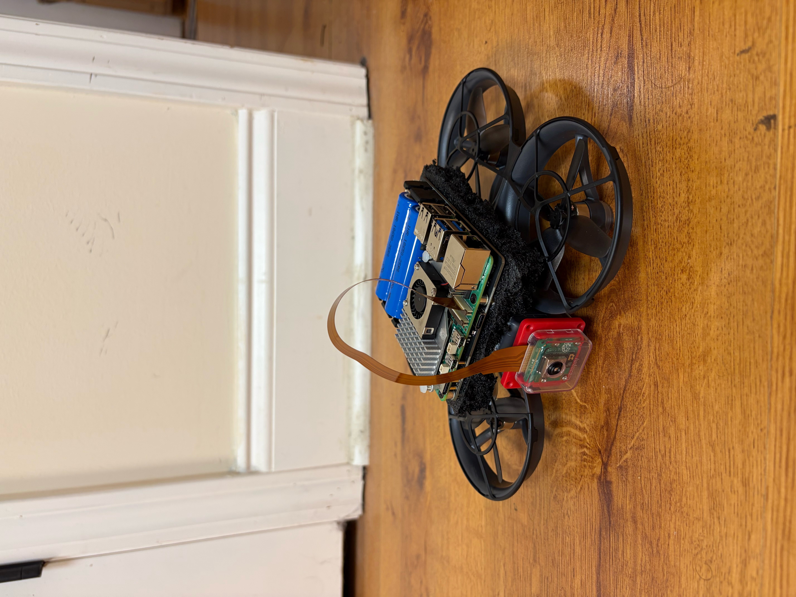
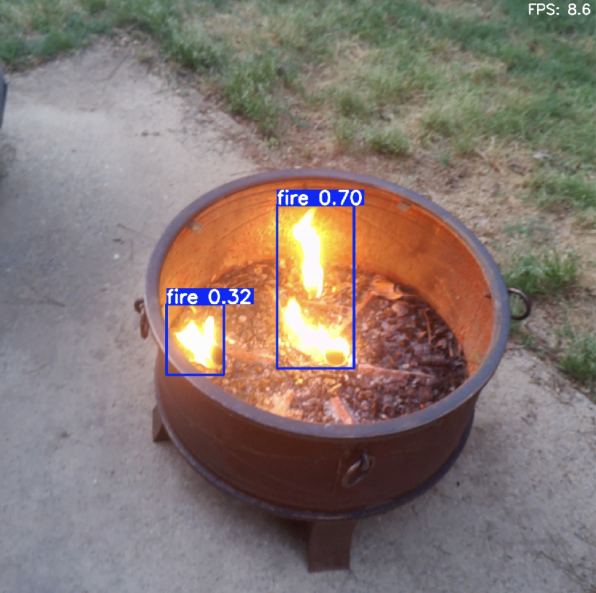

# Drone-Based Fire & Smoke Detection (YOLO)

## Overview
This project uses a YOLO-based object detection model to detect fire and smoke in real time. The model was trained on a custom dataset and optimized for deployment on edge devices such as the Raspberry Pi.

## Features
- Fire and smoke detection using YOLO26n
- Trained on ~35,000 labeled images
- Real-time inference (8–9 FPS on Raspberry Pi)
- Model converted to NCNN for faster edge performance

## Project Structure
- `yolo-fire-detection.ipynb` – Training, tuning, and evaluation notebook  
- `Fire and Smoke Dataset/` – Dataset and labels  
- `runs/detect/` – Training results and model outputs  
- `yolo26n.pt` – Base pretrained model  
- `yolo object detection/` – Raspberry Pi inference script  

## Model Performance
- Validation mAP50: **78.3%**  
- Test mAP50: **75.3%**

## Screenshots

### Drone Setup

### Live Demo

